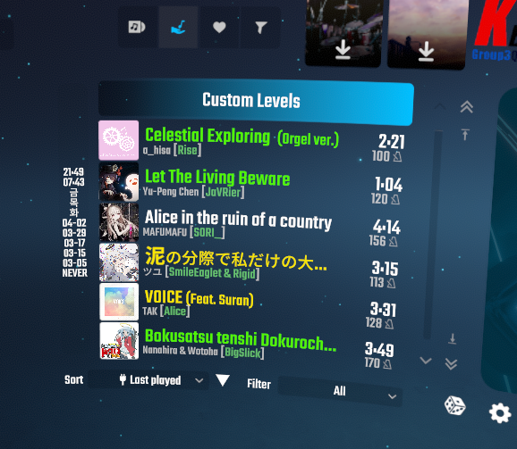
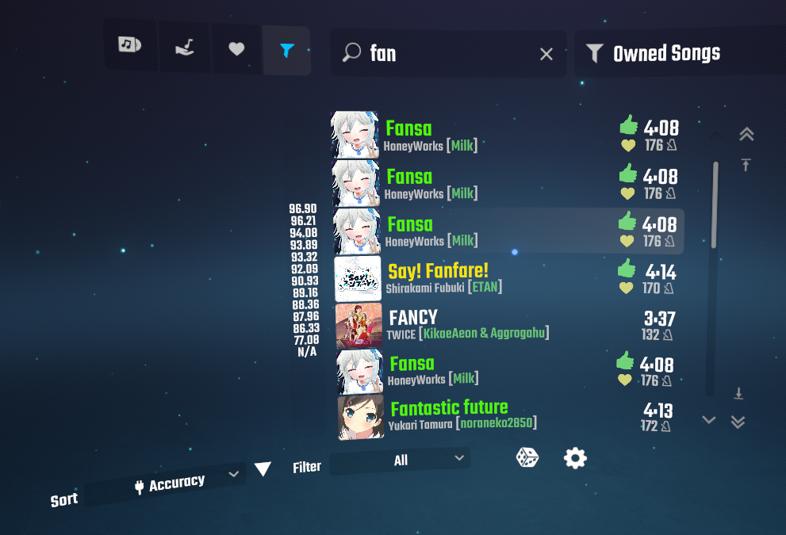

# BetterSort

This contains additional beat saber sort plugins can be used with [BetterSongList](https://github.com/kinsi55/BeatSaber_BetterSongList).
All plugins here requires BetterSongList.

## BetterSort.LastPlayed

It records your last played date and sorts by it.

## BetterSort.Accuracy

It sorts by difficulty according to your best accuracy.

## Installation

Use [ModAssistant](https://github.com/Assistant/ModAssistant/releases/latest). I'll support that.

If it's not available or new features is added later, download [the latest release](https://github.com/nanikit/BetterSort/releases/latest).

I won't release BetterSort.Accuracy on ModAssistant for a while because it may be unstable.

## Usage

Just click left-bottom sort button in song select scene, and select 'Last played' or 'Accuracy'.

## Q&A

- Q: Just installed, it doesn't sort at all.

  A: For LastPlayed right after installation there's no play history. So play first. 

  For Accuracy it gathers your scores from scoresaber and beatleader at first launch. It takes a while according to your history. 
  Currently there's no UI for checking the import progress. If you want to see it open the log file.

- Q: Reverse sort not work. 
  A: I didn't support it intentionally. Currently BetterSongList doesn't remember sort direction of each sorter, it confused me.
